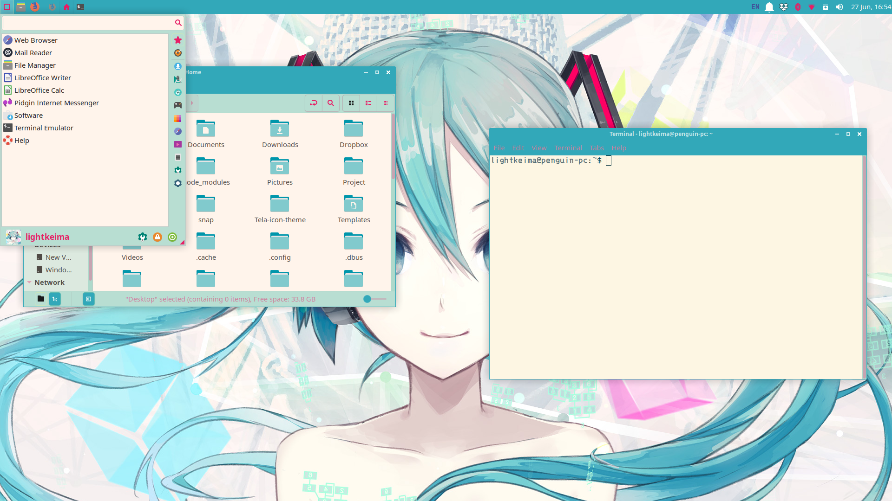
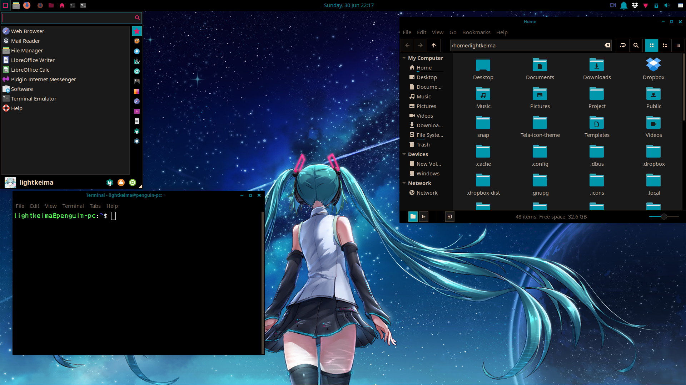

# GTK+3 MIKU THEME 

### Table of Contents
* [Installation](#installation)
* [Screenshot](#screenshot)

## Installation

```bash
git clone https://github.com/lightkeima/Miku-theme.git
cd Miku-theme
./install.sh
```

## Screenshot

Light 
Wallpaper by [imocreator](https://www.deviantart.com/imocreator/art/Miku-Hatsune-V4X-Beta-Download-560850807)

Dark 
Wallpaper by [JiroFly](https://www.pixiv.net/member.php?id=7291499)

